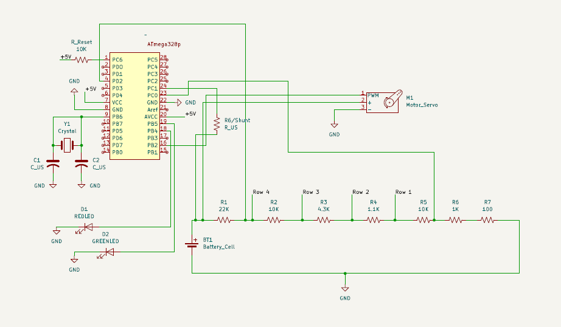

# Smart Locker Project

A secure "battery-powered" smart locker system built on a standalone ATmega328p microcontroller. 
Features numeric-locking, encrypted password storing, idle/sleep mode for power efficency, and 
low battery alerts. This is all being made without the use of external libraries.

***

## Features
   - SG90 Servo motor control, made with a custom PWM servo library, using Timer1 interrupts
   - 12-key numeric keypad, made with a resistor ladder
   - Finite State Machine (_FSM_) manages all system states, such as, _LOCKED, UNLOCKED, SLEEP, PASSKEY CHECKING, etc._
   - Power consumption efficiency through our sleep mode, works using SMCR registers and wakes on INT0 hardware interrupts
   - No hard-coded passkeys, password encryption with a simple XOR checksum with random (_rand()_) salt
   - Overcurrent detection/protection, if rotor is jammed, program will detect that via shunt resistor
   - LED feedback
   - Low battery alerting, LEDs flash when battery falls below threshold

## Hardware

### Components

| Component | Purpose |
|---|---|
| ATmega328p/Arduino Uno | Microcontroller |
| SG90 Servo | Lock/unlock tool |
| 3×4 Matrix Keypad | User input device |
| MCP1702 LDO Regulator / Voltage | 9V → 5V regulation |
| 16 MHz Crystal & 2× 22pF caps | External clock |
| 10kΩ pull-up resistor | Reset pin stabilization |
| 0.1 µF capacitor | AREF decoupling (pin 21) |
| 1Ω shunt resistor (_better option is a 0.1Ω_) | Overcurrent / block detection |
| 100kΩ + 47kΩ resistors | Battery voltage divider |
| 10kΩ pull-down resistor | Keypad ADC stabilization |
| Red, Green, Yellow LEDs | State feedback |
| 9V battery | Power source |
| Wiring | For connectivity between parts |
| 9V battery | Power source |

 

### Pin Mapping (ATmega328p)

| Pin | Function |
|---|---|
| D2 (INT0) | Keypad wake interrupt |
| D3, D4, D5 | Keypad columns (C1–C3) |
| D10 (OC1B) | Servo PWM |
| D12 | Red LED |
| D13 | Green LED |
| A0 | Keypad row ADC |
| A1 | Servo shunt current sense |
| A2 | Battery voltage divider |

## Build & Flashing (_How to Use_)

1. Wire the circuit just as you see in the schematic.
   (_currently the implemation of the standalone chip is a bit finicky, so for true functionality we
     reccommend using just the Arduino Uno, if you are uisng that disregard anything related to the standalone chip_)
2. Burn the Arduino Bootloader to the ATmega328p using Arduino Uno as an ISP (_if using Arduino Uno and not ATmega328p as a    standalone chip don't do this step_)
3. Upload the .iso file onto your Arduino Uno/ATmega328p standalone chip
